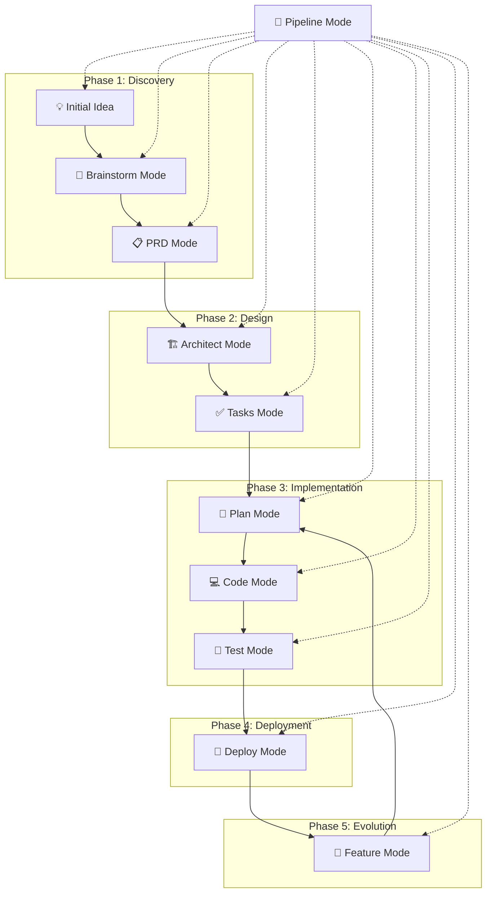

# Hash Prompts - AI Command Collection

A powerful collection of specialized prompts designed to guide AI assistants into specific operational modes for enhanced productivity and output quality. Named "Hash Prompts" for their distinctive `/#:` command syntax.


## Why Hash Prompts?

The name "Hash Prompts" comes from our unique command syntax `/#:` where:
- `/` starts a Claude command
- `#` provides a short, memorable namespace
- `:` separates namespace from command name

This creates commands like `/#:brainstorm` and `/#:architect` that are easy to type and remember while avoiding conflicts with other command systems.

## Quick Installation

### Option 1: One-Line Install (Recommended)

**Unix/Linux/macOS:**
```bash
curl -sSL https://raw.githubusercontent.com/dimitritholen/prompts/features/add_pipeline/scripts/install.sh | bash
```

**Windows (PowerShell):**
```powershell
irm https://raw.githubusercontent.com/dimitritholen/prompts/features/add_pipeline/scripts/install.ps1 | iex
```

### Option 2: Clone and Install

```bash
git clone https://github.com/dimitritholen/prompts.git
cd prompts

# Unix/Linux/macOS
./scripts/install.sh

# Windows
powershell -ExecutionPolicy Bypass -File .\scripts\install.ps1
```

### What Gets Installed

Hash Prompts installs commands under the `#` namespace, giving you access to:
- `/#:brainstorm` - Idea validation and development
- `/#:prd` - Product requirements documentation
- `/#:architect` - System architecture design
- `/#:tasks` - Task breakdown and planning
- `/#:plan` - Detailed implementation planning
- `/#:code` - Code implementation
- `/#:feature` - Feature integration
- `/#:test` - Testing strategy
- `/#:deploy` - Deployment and DevOps
- `/#:pipeline` - Workflow orchestration
- `/#:help` - Display command reference and workflows

Commands are installed globally by default (~/.claude/commands) but can be installed locally for project-specific use.

## Available Prompts

### 1. **architect.md** - System Architecture Mode

**Purpose**: Transforms the AI into an expert system architect focused on designing robust, scalable architectures.

**Key Features**:

- Comprehensive research of industry best practices
- Technology stack evaluation and selection
- Scalability and performance planning
- Security architecture design
- Detailed documentation output

**How to Use**:

```
/#:architect Design a scalable e-commerce platform architecture
```

Or with the prompt file directly:
```
@architect.md
Process @my_project_prd file.
```

### 2. **brainstorm.md** - Expert Idea Development & Critical Analysis

**Purpose**: Enables brutally honest idea evaluation, research-based validation, and PRD creation optimized for junior developers.

**Key Features**:

- Expert role assumption (10+ years in field)
- Sequential thinking methodology for deep analysis
- Comprehensive clarifying questions
- Industry research and competitor analysis
- Junior-developer-friendly PRD output

**How to Use**:

```
/#:brainstorm I have an idea for a water tracking app. Help me develop this concept.
```

### 3. **code.md** - Coding Implementation Mode

**Purpose**: Focuses on writing clean, efficient, and maintainable code following industry best practices.

**Key Features**:

- Pre-implementation dependency analysis
- Adherence to SOLID principles and clean code practices
- Comprehensive testing requirements
- Incremental implementation approach
- Documentation synchronization

**How to Use**:

```
/#:code Implement the user authentication system based on the PRD
```

### 4. **plan.md** - Planning Mode

**Purpose**: Research, analyze, and formulate comprehensive solutions before any implementation.

**Key Features**:

- Five-phase planning workflow
- Exhaustive online research
- Multi-angle analysis (technical, business, UX, maintenance)
- Multiple solution approaches with trade-offs
- Risk analysis and mitigation strategies

**How to Use**:

```
/#:plan Plan the implementation of a real-time chat feature
```

### 5. **prd.md** - Product Requirements Document Creation

**Purpose**: Transforms ideas into comprehensive, actionable PRDs following the SLC principle (Simple, Lovable, Complete).

**Key Features**:

- Discovery and market research phase
- Gap analysis and edge case identification
- Structured PRD template
- Technical architecture recommendations
- Success metrics and timeline planning

**How to Use**:

```
/#:prd Create a PRD for a task management mobile app
```

### 6. **tasks.md** - Task Breakdown Mode

**Purpose**: Converts PRDs into atomic, actionable tasks with clear implementation paths.

**Key Features**:

- Pre-task technology research
- Atomic task creation (1-4 hour chunks)
- Dependency mapping and management
- Industry-standard solution integration
- Self-contained context for each task

**How to Use**:

```
/#:tasks Break down the e-commerce PRD into implementation tasks
```

### 7. **feature.md** - Feature Integration Mode

**Purpose**: Seamlessly integrates new feature requests into existing task systems while maintaining project coherence and avoiding duplication.

**Key Features**:

- Atomic feature integration at task level
- Enhancement of existing tasks vs creating duplicates
- Dependency chain maintenance
- Documentation synchronization
- Incremental enhancement approach

**How to Use**:

```
/#:feature Add user authentication with OAuth2 support for Google and GitHub providers
```

### 8. **test.md** - Comprehensive Testing Strategy

**Purpose**: Ensures robust, reliable code through systematic testing approaches that catch bugs early and prevent regressions.

**Key Features**:

- Test-first mindset and pyramid strategy
- Unit, integration, and E2E test planning
- Performance and security testing
- CI/CD integration guidance
- Living documentation through tests

**How to Use**:

```
/#:test Create comprehensive test strategy for the e-commerce platform
```

### 9. **deploy.md** - Deployment & DevOps Mode

**Purpose**: Ensures smooth, reliable deployments and robust production operations through infrastructure as code and automation.

**Key Features**:

- Infrastructure as code principles
- CI/CD pipeline design
- Container orchestration strategies
- Monitoring and observability setup
- Progressive deployment patterns

**How to Use**:

```
/#:deploy Design deployment strategy for microservices architecture
```

### 10. **pipeline.md** - Pipeline Orchestration

**Purpose**: Guides projects through the complete journey from ideation to production, ensuring smooth handoffs between phases.

**Key Features**:

- End-to-end workflow orchestration
- Quality gates between stages
- Seamless mode transitions
- Context preservation across phases
- Pipeline customization for project types

**How to Use**:

```
/#:pipeline start
```

### 11. **help.md** - Command Reference and Guide

**Purpose**: Provides comprehensive help and guidance for all Hash Prompts commands and workflows.

**Key Features**:

- Complete command reference with descriptions
- Typical workflow examples
- File organization guide
- Agent overview and usage
- Best practices and tips

**How to Use**:

```
/#:help
```

Or for specific command help:
```
/#:help brainstorm
```

## Complete Development Pipeline

The prompts form a comprehensive pipeline from ideation to deployment:



### Pipeline Stages Explained

1. **Discovery Phase**
   - Start with an idea
   - Use Brainstorm Mode for validation and research
   - Formalize with PRD Mode

2. **Design Phase**
   - Create system architecture with Architect Mode
   - Break down into atomic tasks with Tasks Mode

3. **Implementation Phase**
   - Plan the approach with Plan Mode
   - Implement with Code Mode
   - Validate with Test Mode

4. **Deployment Phase**
   - Deploy to production with Deploy Mode

5. **Evolution Phase**
   - Add features with Feature Mode
   - Return to planning and implementation

**Pipeline Mode** orchestrates the entire flow, ensuring smooth transitions and quality gates between stages.

## Usage Guidelines

### Using Hash Prompts Commands

After installation, you can use Hash Prompts commands directly in Claude:

```
/#:brainstorm I want to build a fitness tracking app

/#:architect Design the system architecture

/#:pipeline start
```

The `/#:` prefix identifies these as Hash Prompts, providing a clean namespace that won't conflict with other commands.

### Using Prompt Files Directly

You can also reference the prompt files directly in your AI coding tools:

1. **Reference Before Prompt**: Include the prompt file at the beginning of your message:
   
   ```
   @architect.md
   [Your specific request]
   ```

2. **Combine Multiple Prompts**: You can chain prompts for comprehensive workflows:
   
   ```
   @brainstorm.md
   [Develop idea]
   
   Then:
   @prd.md
   [Create PRD from brainstormed concept]
   
   Finally:
   @tasks.md
   [Break down into tasks]
   ```

3. **Mode Switching**: The AI will maintain the specified mode throughout the conversation until you reference a different prompt or explicitly ask to switch modes.

### Best Practices

1. **Choose the Right Mode**: 
   
   - Use `brainstorm.md` for idea validation and development
   - Use `prd.md` for formal requirement documentation
   - Use `architect.md` for system design decisions
   - Use `tasks.md` for breaking down work into manageable pieces
   - Use `plan.md` before starting complex features
   - Use `code.md` for actual implementation
   - Use `test.md` for comprehensive testing strategies
   - Use `deploy.md` for deployment and infrastructure
   - Use `feature.md` for integrating new features into existing projects
   - Use `pipeline.md` to orchestrate the entire workflow

2. **Provide Context**: The more specific context you provide, the better the output quality.

3. **Follow the Workflow**: For new projects, consider this sequence:
   
   ```
   brainstorm → prd → architect → tasks → plan → code
   ```
   
   For adding features to existing projects:
   ```
   feature → plan → code
   ```

4. **Leverage Research**: These prompts emphasize research-based approaches. Allow the AI to search for best practices and industry standards.

## Notes

- These prompts are designed to work with AI assistants that support file references (like Claude, Cursor, etc.)
- Each prompt enforces specific behaviors and output formats optimized for its purpose
- The prompts encourage the AI to ask clarifying questions before proceeding
- All prompts emphasize industry best practices and avoiding reinventing the wheel
