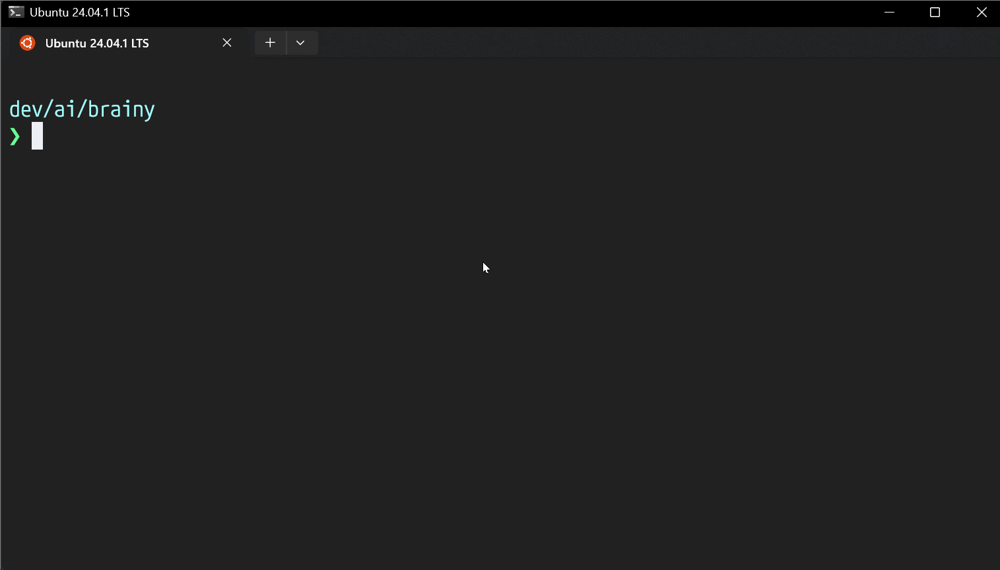

# AI Prompts Collection

This folder contains specialized prompts designed to guide AI assistants into specific operational modes for enhanced productivity and output quality.



## Available Prompts

### 1. **architect.md** - System Architecture Mode

**Purpose**: Transforms the AI into an expert system architect focused on designing robust, scalable architectures.

**Key Features**:

- Comprehensive research of industry best practices
- Technology stack evaluation and selection
- Scalability and performance planning
- Security architecture design
- Detailed documentation output

**How to Use**:

```
@architect.md
Design a scalable e-commerce platform architecture
```

```
@architect.md
Process @my_project_prd file.
```

### 2. **brainstorm.md** - Expert Idea Development & Critical Analysis

**Purpose**: Enables brutally honest idea evaluation, research-based validation, and PRD creation optimized for junior developers.

**Key Features**:

- Expert role assumption (10+ years in field)
- Sequential thinking methodology for deep analysis
- Comprehensive clarifying questions
- Industry research and competitor analysis
- Junior-developer-friendly PRD output

**How to Use**:

```
@brainstorm.md
I have an idea for a water tracking app. Help me develop this concept.
```

### 3. **code.md** - Coding Implementation Mode

**Purpose**: Focuses on writing clean, efficient, and maintainable code following industry best practices.

**Key Features**:

- Pre-implementation dependency analysis
- Adherence to SOLID principles and clean code practices
- Comprehensive testing requirements
- Incremental implementation approach
- Documentation synchronization

**How to Use**:

```
@code.md
Implement the user authentication system based on the PRD
```

### 4. **plan.md** - Planning Mode

**Purpose**: Research, analyze, and formulate comprehensive solutions before any implementation.

**Key Features**:

- Five-phase planning workflow
- Exhaustive online research
- Multi-angle analysis (technical, business, UX, maintenance)
- Multiple solution approaches with trade-offs
- Risk analysis and mitigation strategies

**How to Use**:

```
@plan.md
Plan the implementation of a real-time chat feature
```

### 5. **prd.md** - Product Requirements Document Creation

**Purpose**: Transforms ideas into comprehensive, actionable PRDs following the SLC principle (Simple, Lovable, Complete).

**Key Features**:

- Discovery and market research phase
- Gap analysis and edge case identification
- Structured PRD template
- Technical architecture recommendations
- Success metrics and timeline planning

**How to Use**:

```
@prd.md
Create a PRD for a task management mobile app
```

### 6. **tasks.md** - Task Breakdown Mode

**Purpose**: Converts PRDs into atomic, actionable tasks with clear implementation paths.

**Key Features**:

- Pre-task technology research
- Atomic task creation (1-4 hour chunks)
- Dependency mapping and management
- Industry-standard solution integration
- Self-contained context for each task

**How to Use**:

```
@tasks.md
Break down the e-commerce PRD into implementation tasks
```

## Usage Guidelines

### In AI Coding Tools

1. **Reference Before Prompt**: Include the prompt file at the beginning of your message:
   
   ```
   @architect.md
   [Your specific request]
   ```

2. **Combine Multiple Prompts**: You can chain prompts for comprehensive workflows:
   
   ```
   @brainstorm.md
   [Develop idea]
   
   Then:
   @prd.md
   [Create PRD from brainstormed concept]
   
   Finally:
   @tasks.md
   [Break down into tasks]
   ```

3. **Mode Switching**: The AI will maintain the specified mode throughout the conversation until you reference a different prompt or explicitly ask to switch modes.

### Best Practices

1. **Choose the Right Mode**: 
   
   - Use `architect.md` for system design decisions
   - Use `brainstorm.md` for idea validation and development
   - Use `plan.md` before starting complex features
   - Use `code.md` for actual implementation
   - Use `prd.md` for formal requirement documentation
   - Use `tasks.md` for project management

2. **Provide Context**: The more specific context you provide, the better the output quality.

3. **Follow the Workflow**: For new projects, consider this sequence:
   
   ```
   brainstorm → prd → architect → tasks → plan → code
   ```

4. **Leverage Research**: These prompts emphasize research-based approaches. Allow the AI to search for best practices and industry standards.

## Notes

- These prompts are designed to work with AI assistants that support file references (like Claude, Cursor, etc.)
- Each prompt enforces specific behaviors and output formats optimized for its purpose
- The prompts encourage the AI to ask clarifying questions before proceeding
- All prompts emphasize industry best practices and avoiding reinventing the wheel
