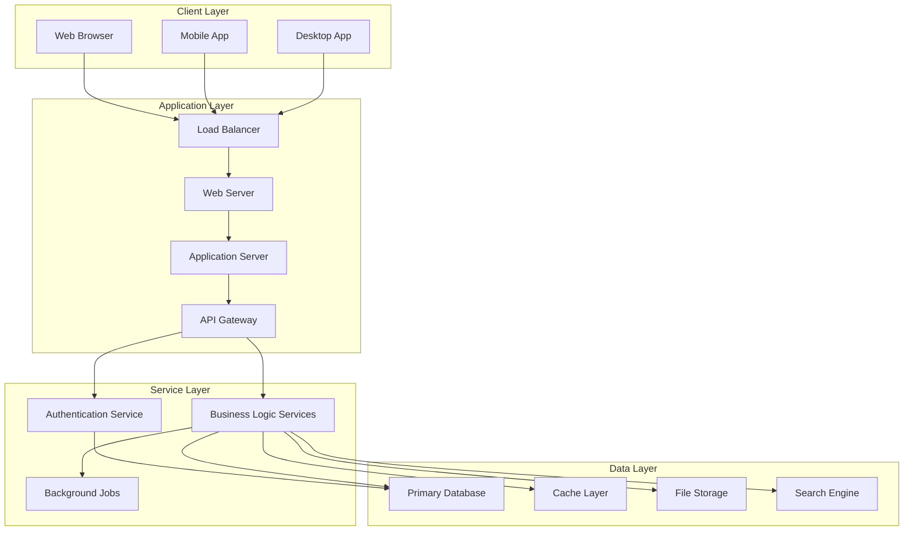
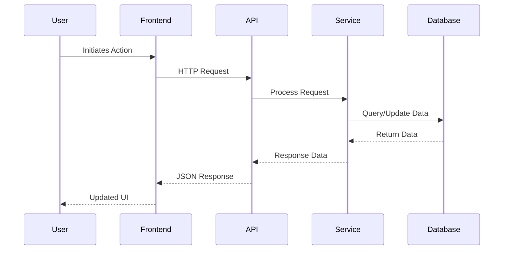
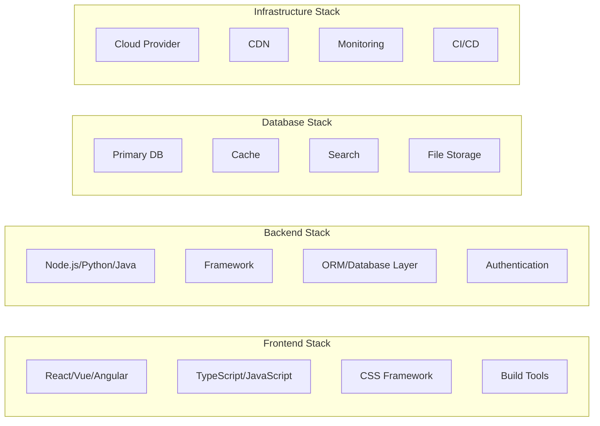
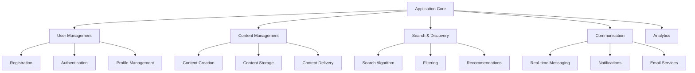
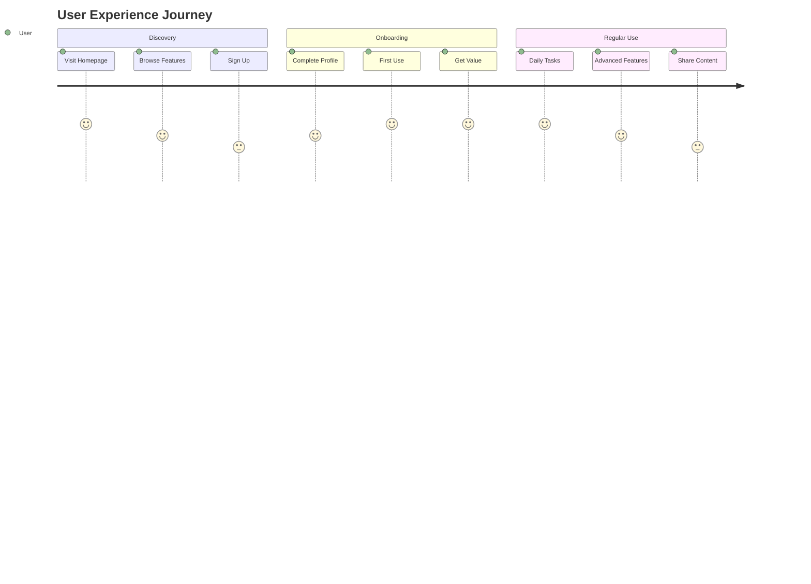

## Context

```bash
echo "=== HOW IT'S MADE: SOFTWARE APPLICATION ANALYSIS ==="
echo "Target Application(s): $ARGUMENTS"
echo "Analysis Date: $(date)"
echo "Audience: Junior Developers"
echo "Output: Technical architecture, diagrams, and educational explanations"
echo "Research Method: Parallel specialized agents"
```

## Your Task

Conduct a comprehensive technical analysis of: **$ARGUMENTS**

You will reverse-engineer and document how these software applications are built, including their tech stacks, architectural patterns, infrastructure design, and core functionality. This analysis is designed to educate junior developers by providing clear explanations, visual diagrams, and practical insights.

**RESEARCH METHODOLOGY:**
- Deploy 6 parallel specialized research agents
- Create detailed Mermaid diagrams for visualization
- Provide educational explanations and reasoning
- Generate lightweight feature specifications
- Focus on practical learning outcomes for junior developers

---

## STEP 1: APPLICATION ANALYSIS INITIALIZATION

**VALIDATION CHECKPOINT:**
- Confirm application names are clearly specified
- Verify applications exist and are accessible for research
- Establish research scope and depth requirements

**EDUCATIONAL CONTEXT SETTING:**
For junior developers, we'll explore these applications by asking fundamental questions:
- **What problem does this application solve?**
- **How is it architected to solve this problem efficiently?**
- **What technologies were chosen and why?**
- **How do the different components work together?**
- **What can we learn from their design decisions?**

---

## STEP 2: PARALLEL RESEARCH AGENT DEPLOYMENT

Think step-by-step about the research approach for **$ARGUMENTS**:

Let me deploy 6 specialized research agents to conduct comprehensive analysis:

**🔍 DEPLOYING RESEARCH TEAM (PARALLEL EXECUTION):**

**Agent 1: Tech Stack Detective**
Research the technology foundations of $ARGUMENTS:
- Frontend technologies (frameworks, libraries, tooling)
- Backend technologies (languages, frameworks, databases)
- Infrastructure and hosting solutions
- Development and deployment tools
- Third-party integrations and APIs
- Why these technologies were likely chosen
- Alternative tech stack options and tradeoffs

**Agent 2: Architecture Analyst**
Analyze the high-level system architecture:
- Overall system design patterns (MVC, microservices, monolith, etc.)
- Client-server architecture and communication patterns
- Database design and data flow
- Caching strategies and performance optimizations
- Security architecture and authentication flows
- Scalability patterns and load handling
- API design and integration patterns

**Agent 3: Infrastructure Engineer**
Investigate the infrastructure and deployment setup:
- Cloud providers and services used
- CDN and content delivery strategies
- Database hosting and management
- Monitoring and logging solutions
- CI/CD pipeline and deployment strategies
- Container orchestration (if applicable)
- Network architecture and security

**Agent 4: Feature Specification Expert**
Document core functionality and features:
- Primary user workflows and use cases
- Key features and their implementation complexity
- User interface patterns and design decisions
- Data models and business logic
- Integration points and external dependencies
- Feature prioritization and MVP analysis
- Unique selling points and differentiators

**Agent 5: Theory & Concepts Explainer**
Research the underlying theories and principles:
- Computer science concepts implemented
- Design patterns and architectural principles
- Algorithms and data structures used
- Performance optimization techniques
- Security principles and implementations
- User experience design principles
- Business logic and domain modeling

**Agent 6: Educational Content Creator**
Develop learning materials and explanations:
- Beginner-friendly explanations of complex concepts
- Code examples and implementation details
- Common pitfalls and best practices
- Learning resources and next steps
- Practical exercises and projects
- Career relevance and skill development

---

## STEP 3: ARCHITECTURE VISUALIZATION & DIAGRAM CREATION

**CHECKPOINT:** Validate research completion
- Ensure all agents have gathered comprehensive data
- Cross-reference findings for accuracy and consistency
- Identify any gaps requiring additional research

**MERMAID DIAGRAM GENERATION:**

Based on the research findings, create comprehensive visual representations:

**1. High-Level System Architecture Diagram**


**2. Data Flow Diagram**


**3. Technology Stack Visualization**


**4. Feature Component Diagram**


---

## STEP 4: EDUCATIONAL CONTENT SYNTHESIS

**INTEGRATION CHECKPOINT:**
- Consolidate all research findings into coherent narrative
- Ensure technical accuracy and educational value
- Validate that content is appropriate for junior developers

**COMPREHENSIVE ANALYSIS FRAMEWORK:**

For each application in **$ARGUMENTS**, provide detailed educational analysis:

### 🎯 **APPLICATION OVERVIEW**

**What Problem Does It Solve?**
- Primary user pain points addressed
- Market need and business case
- Value proposition and competitive advantage

**Target Audience Analysis:**
- Primary user demographics
- Use cases and user journeys
- Scale and performance requirements

### 🏗️ **ARCHITECTURAL DEEP DIVE**

**System Design Principles:**
Think step-by-step about the architectural decisions:

1. **Overall Architecture Pattern**
   - Monolithic vs. Microservices approach
   - Why this pattern was chosen
   - Benefits and tradeoffs of the chosen approach
   - How it supports the application's requirements

2. **Scalability Strategy**
   - Horizontal vs. vertical scaling approaches
   - Database sharding and partitioning strategies
   - Caching layers and performance optimization
   - Load balancing and traffic distribution

3. **Data Architecture**
   - Database selection rationale (SQL vs. NoSQL)
   - Data modeling and schema design
   - Data consistency and integrity strategies
   - Backup and disaster recovery approaches

**🧠 JUNIOR DEVELOPER LEARNING NOTES:**
```
💡 Key Insight: [Explain why certain architectural decisions were made]
🔍 Deep Dive: [Provide detailed explanation of complex concepts]
⚠️ Common Pitfall: [Highlight potential mistakes and how to avoid them]
🚀 Pro Tip: [Share advanced techniques and best practices]
```

### 🛠️ **TECHNOLOGY STACK ANALYSIS**

**Frontend Technology Choices:**
- Framework selection rationale (React/Vue/Angular/etc.)
- State management approaches
- Styling and UI component strategies
- Performance optimization techniques

**Backend Technology Choices:**
- Programming language selection reasoning
- Framework and library ecosystem
- Database and storage solutions
- API design and communication protocols

**Infrastructure Technology Choices:**
- Cloud provider selection criteria
- Deployment and orchestration strategies
- Monitoring and observability tools
- Security and compliance measures

**🎓 EDUCATIONAL EXPLANATIONS FOR JUNIOR DEVELOPERS:**

For each technology choice, explain:
- **What it is:** Clear definition and purpose
- **Why it was chosen:** Benefits and use case fit
- **How it works:** Basic implementation concepts
- **Alternatives:** Other options and when to use them
- **Learning path:** How to get started with this technology

### ⚙️ **FEATURE SPECIFICATION & IMPLEMENTATION**

**Core Feature Analysis:**

For each major feature, provide:

**Feature Matrix:**
| Feature | Complexity | Tech Stack | Implementation Notes |
|---------|------------|------------|---------------------|
| User Authentication | Medium | JWT + OAuth | Session management, security |
| Real-time Chat | High | WebSocket + Redis | Scalability challenges |
| File Upload | Medium | Multer + S3 | Storage and CDN integration |
| Search Function | High | Elasticsearch | Full-text search, indexing |

**Implementation Deep Dive:**
1. **User Story:** "As a user, I want to..."
2. **Technical Requirements:** Performance, security, scalability
3. **Implementation Approach:** Step-by-step technical solution
4. **Code Architecture:** How the feature fits into the overall system
5. **Testing Strategy:** How to ensure quality and reliability

### 🧮 **ALGORITHMS & DATA STRUCTURES**

**Key Computer Science Concepts Implemented:**
- Sorting and searching algorithms used
- Data structure choices and optimizations
- Caching strategies and cache invalidation
- Rate limiting and throttling implementations
- Recommendation algorithms (if applicable)
- Security algorithms and encryption methods

### 🚀 **PERFORMANCE & OPTIMIZATION**

**Performance Engineering Analysis:**
- Database query optimization techniques
- Frontend performance optimization
- Network and bandwidth optimization
- Memory and CPU usage optimization
- Mobile performance considerations

### 🔐 **SECURITY ARCHITECTURE**

**Security Implementation Analysis:**
- Authentication and authorization patterns
- Data encryption at rest and in transit
- Input validation and sanitization
- Protection against common vulnerabilities (OWASP Top 10)
- Privacy and data protection measures

---

## STEP 5: LIGHTWEIGHT FEATURE SPECIFICATION

**FEATURE SPECIFICATION TEMPLATE:**

Generate a comprehensive feature specification document:

### **APPLICATION: [Name]**

#### **📋 FEATURE INVENTORY**

**Core Features (Must-Have):**
1. **User Management System**
   - Registration and authentication
   - Profile management
   - Permission and role handling
   - Implementation complexity: 7/10
   - Estimated development time: 2-3 weeks

2. **[Primary Feature]**
   - Detailed description
   - User workflows
   - Technical requirements
   - Implementation complexity: X/10
   - Estimated development time: X weeks

**Enhanced Features (Nice-to-Have):**
- Feature prioritization matrix
- Development effort estimates
- User impact assessment

**Advanced Features (Future Iterations):**
- Scalability enhancements
- Premium functionality
- Integration capabilities

#### **🎨 USER EXPERIENCE DESIGN**

**Design Principles Observed:**
- User interface patterns
- Navigation and information architecture
- Responsive design approach
- Accessibility considerations

**User Journey Mapping:**


#### **⚡ PERFORMANCE REQUIREMENTS**

**Performance Benchmarks:**
- Page load times: < 3 seconds
- API response times: < 500ms
- Concurrent users supported: 10,000+
- Database query performance: < 100ms
- Mobile performance targets

#### **🛡️ SECURITY & COMPLIANCE**

**Security Requirements:**
- Data encryption standards
- Authentication mechanisms
- Authorization controls
- Audit logging requirements
- Compliance considerations (GDPR, etc.)

---

## STEP 6: JUNIOR DEVELOPER LEARNING GUIDE

**🎓 EDUCATIONAL OUTCOMES:**

After studying this analysis, junior developers should understand:

**Technical Concepts Mastered:**
- [ ] System architecture patterns and their applications
- [ ] Technology stack selection criteria and tradeoffs
- [ ] Database design and data modeling principles
- [ ] API design and integration patterns
- [ ] Performance optimization techniques
- [ ] Security implementation best practices

**Practical Skills Developed:**
- [ ] How to analyze existing applications
- [ ] How to make technology stack decisions
- [ ] How to design scalable architectures
- [ ] How to write technical specifications
- [ ] How to create system diagrams
- [ ] How to prioritize features and development effort

**Learning Resources & Next Steps:**
1. **Beginner Projects:** Simple applications to practice concepts
2. **Intermediate Challenges:** More complex implementations
3. **Advanced Topics:** Scalability and performance optimization
4. **Career Development:** How these skills apply to job opportunities

**🚀 PRACTICAL EXERCISES:**

1. **Architecture Design Challenge:**
   "Design a simplified version of [application] using different technology choices"

2. **Feature Implementation Project:**
   "Implement the core authentication system using the patterns observed"

3. **Performance Analysis Task:**
   "Identify potential bottlenecks and propose optimization strategies"

---

## FINAL DELIVERABLES

**COMPLETION CRITERIA (ALL must be ✅):**
- [ ] Comprehensive tech stack analysis completed
- [ ] System architecture diagrams created (Mermaid format)
- [ ] Infrastructure analysis documented
- [ ] Feature specifications generated
- [ ] Educational explanations provided for junior developers
- [ ] Performance and security analysis included
- [ ] Learning resources and next steps identified
- [ ] Practical exercises and projects suggested
- [ ] Code examples and implementation details provided
- [ ] Common pitfalls and best practices documented

**SUCCESS VALIDATION:**
The analysis is successful when a junior developer can:
1. Understand how the application is built and why
2. Identify the key technologies and their purposes
3. Explain the architectural decisions and tradeoffs
4. Create their own simplified version of core features
5. Make informed technology choices for similar projects
6. Understand the career relevance of the technologies used

**ERROR HANDLING:**
- If application details are limited, research similar applications for patterns
- If technology information is unavailable, make educated inferences based on public information
- If diagrams are too complex, create simplified versions with detailed explanations
- If concepts are too advanced, provide foundational explanations and learning resources

This comprehensive analysis will provide junior developers with a complete understanding of how **$ARGUMENTS** is built, why specific technologies were chosen, and how they can apply these learnings to their own projects and career development.